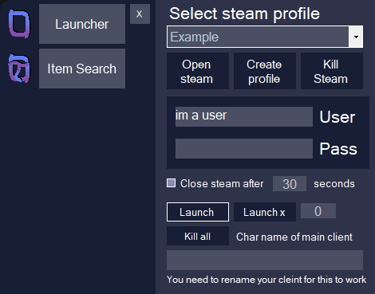
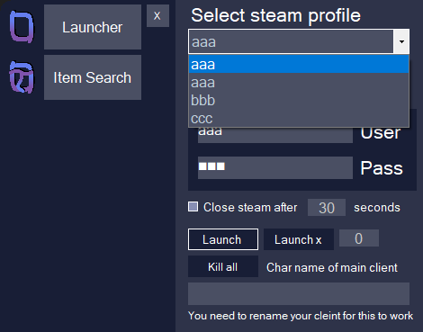
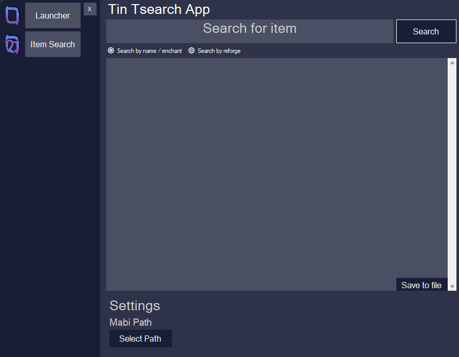
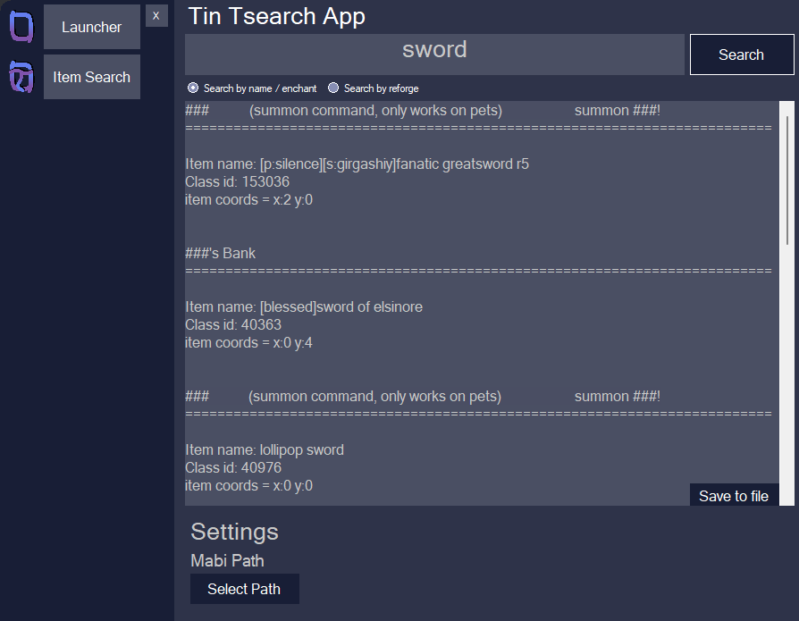

# Mabi-Steam-Launcher
just a way to launch mabi using steam 

on first launch it will ask you to create a profile

## first launch
* Profile name is the name you want to give said profile
* user name is the user name of the steam account that client uses
* password is the password of said account 
  * (THIS IS STORED IN CLEAR TEXT. DO NOT SHARE YOUR profile.csv FILE. IT IS NOT MY FAULT IF SOMEONE STEALS YOUR ACCOUNTS)
* path to steam is for the path of steam.exe (not mabinogi) just click the select steam button and go to your steam install

once you have staved the profile it will take you to the main program, this will show from now on.
saddly if you want to update the list of accounts you will need to reopen the program, this is (WIP)

## main screen

## how to
* at the top you select what profile you want to use as profile 1 (this comes into play later)
* middle of the screen just shows you the details of the selected profile. just to make sure they are correct
* if you tick the close steam after tick box it will close steam after the ammount of time in the box next to it. in this image that is 30 seconds
* this allows you to multiclient if you have a mod that allows multiclienting
* launch will launch the selected profile
* create profile allows you to create a new profile
* launch x clients with the number next to it will allow you to launch more then one client, it does this one after the other
* for launching multiable clients it will launch the selected profile then x number of profiles after that one.
say i selected profile aaa and in my list of profiles was bbb and ccc as shown here

if i select 2 and then click launch x clients it will launch the selected profile (aaa) and then the profile after (bbb) 
if i select 3 it will launch both aaa and the 2 cleints after it (bbb) and (ccc)
you can only launch upto 7 cleints at a time (this is because i assume you are runnning 1 main and 7 alts for dungeons or something)

if you click kill all clients it will kill all clients.
if you put the name of the main cleint into the text box next to kill all clients your main client will not be closed. 
for this to work you need some kind of way of renaming clients. see tin or some other program

## Item search
For the item search to work you need to have tin installed, this can be found at [rotar.tk/tin/](https://rotar.tk/tin/) . you will need to inject this your self. you can use [abyss](https://blade3575.com/Abyss/), [kanan loader](https://github.com/cursey/kanan-new) or [lazy loader](https://cedricodin.blogspot.com/2019/08/lpe-v350.html) to do this. Once tin is installed and your using up to date mod folder (I have included this in the release, this is uptodate as of 10/17/2021) make sure you open tin.user.ini and set LogItems to 1 (LogItems=1). this will create a folder called "saved items" inside your mabinogi install. 

at this point to use to search you click on search on the sidebar of poi loader. If you have not selected you mabi install it will ask you to. 

click on select path and navigate to your mabinogi install. 
normally this is at:
steam: C:\Program Files (x86)\Steam\steamapps\common\Mabinogi
nexon launcher: C:\Nexon\Library\mabinogi\appdata
(note you want to select the root folder of mabi, not the saved items folder. the root folder is the folder where client.exe is)

you can then select ether search by name or search by reforge, type in your search term and click search.
a result like below will be given
(note i changed the names in this search to ### for "reasons")

if you search by reforge it will look mostly the same but will also print out the reforges of that item.

last updated for verson 2.0 on  10/17/2021
maybe i'll add more to this app later as i learn

## Credits
* that guy who showed me you can launch mabi via steam with command line
* KaNeoRotar for creating tin to allow the search to work

## copyright stuff (i dont even know if this is legit)

MIT License

Copyright (c) [2020] [poidoe]

Permission is hereby granted, free of charge, to any person obtaining a copy
of this software and associated documentation files (the "Software"), to deal
in the Software without restriction, including without limitation the rights
to use, copy, modify, merge, publish, distribute, sublicense, and/or sell
copies of the Software, and to permit persons to whom the Software is
furnished to do so, subject to the following conditions:

The above copyright notice and this permission notice shall be included in all
copies or substantial portions of the Software.

THE SOFTWARE IS PROVIDED "AS IS", WITHOUT WARRANTY OF ANY KIND, EXPRESS OR
IMPLIED, INCLUDING BUT NOT LIMITED TO THE WARRANTIES OF MERCHANTABILITY,
FITNESS FOR A PARTICULAR PURPOSE AND NONINFRINGEMENT. IN NO EVENT SHALL THE
AUTHORS OR COPYRIGHT HOLDERS BE LIABLE FOR ANY CLAIM, DAMAGES OR OTHER
LIABILITY, WHETHER IN AN ACTION OF CONTRACT, TORT OR OTHERWISE, ARISING FROM,
OUT OF OR IN CONNECTION WITH THE SOFTWARE OR THE USE OR OTHER DEALINGS IN THE
SOFTWARE.

