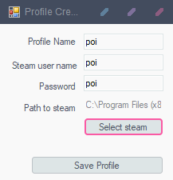
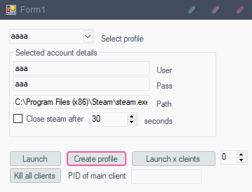
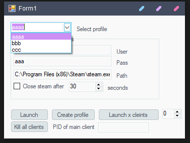

# Mabi-Steam-Launcher
just a way to launch mabi using steam 

on first launch it will ask you to create a profile

## first launch
*Profile name is the name you want to give said profile
*user name is the user name of the steam account that client uses
*password is the password of said account (THIS IS STORED IN CLEAR TEXT. DO NOT SHARE YOUR profile.csv FILE. IT IS NOT MY FAULT IF SOMEONE STEALS YOUR ACCOUNTS)
*path to steam is for the path of steam.exe (not mabinogi) just click the select steam button and go to your steam install

once you have staved the profile it will take you to the main program, this will show from now on.
saddly if you want to update the list of accounts you will need to reopen the program, this is (WIP)

## main screen

## how to
*at the top you select what profile you want to use as profile 1 (this comes into play later)
*middle of the screen just shows you the details of the selected profile. just to make sure they are correct
*if you tick the close steam after tick box it will close steam after the ammount of time in the box next to it. in this image that is 30 seconds
*this allows you to multiclient if you have a mod that allows multiclienting
*launch will launch the selected profile
*create profile allows you to create a new profile
*launch x clients with the number next to it will allow you to launch more then one client, it does this one after the other
*for launching multiable clients it will launch the selected profile then x number of profiles after that one.
say i selected profile aaa and in my list of profiles was bbb and ccc as shown here

if i select 2 and then click launch x clients it will launch the selected profile (aaa) and then the profile after (bbb) 
if i select 3 it will launch both aaa and the 2 cleints after it (bbb) and (ccc)
you can only launch upto 7 cleints at a time (this is because i assume you are runnning 1 main and 7 alts for dungeons or something)

if you click kill all clients it will kill all clients.
if you put the PID of your main client into the text box next to kill all clients. then click the kill all clients it will kill all clients but the main.
if you want to use this look up how to find the PID of a process. 

